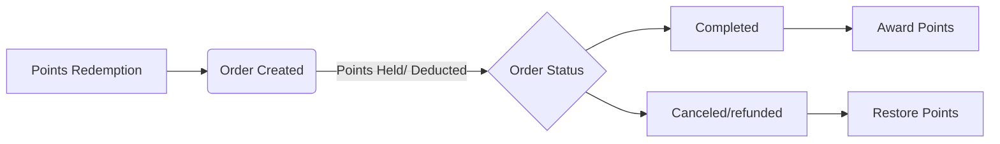

## Overview
The points and rewards plugin allows customers to earn points from their purchases and actions on the site, which 
can then be redeemed for discounts on future orders. Points can be earned through actions such as making a purchase 
or leaving a review on a product.

## Goals
We previously had a Points and Rewards plugin from a third-party developer running on the site, but it had grown 
outdated and needed to be replaced with an updated custom solution. My goal was to replicate functionality and 
improve the user experience while creating something that could fit with the new design of the site.

I needed to create a plugin that could track points earned and handle redemption of those points for discounts at 
checkout. Points events needed to be tracked so that users and administrators could see the history of points 
earned and redeemed. I also needed to be able to migrate points events from the old plugin to the new one so that 
users did not lose their previously earned points.

## Architecture
The plugin can be broken down into a few different sections: Points Management, WooCommerce Integration, Elementor 
Widgets, and Admin Pages.

### Points Management
Points management is split between two classes, `Points_Manager` and `Points_Transaction_Log`. These classes 
represent the core functionality of the plugin, and each has their own database table they use to store points data. 
The `Points_Manager` class manages the user points table, storing the current points balance for each user. The 
Manager is used to update, set, and retrieve points balances. The `Points_Transaction_Log` is used as the record of 
points transactions, storing the details of individual points events. I separated the current points balance from 
the transaction history so that the system could easily retrieve current balances while still maintaining an 
auditable record of how that balance was earned and spent.

### WooCommerce Integration
These classes handle connecting the plugin to the WooCommerce functionality, such as checkout, coupons, and product 
reviews. The `Checkout_Handler` sets up AJAX requests for handling points redemptions by the user at checkout. It 
also handles the processes of deducting and awarding points at different stages of the checkout/order creation 
process. For example, it deducts redeemed points when the order is placed and switched to "processing" status, 
awards points when an order is marked as "completed" status, and refunds spent points when an order is marked as 
"canceled" or "refunded" status.

The `Coupon_Manager` uses WooCommerce's coupon system to create short-lived single use coupons for points 
redemptions. This made it easy to apply discounts and log them on the order line-items.

The `Product_Review_Reward` responds to the comment approval for an order review and awards points to the user who 
made the review.

These integration classes make use of the Points Manager and Transaction Log to apply points changes and track 
transactions with their event descriptions.

### Elementor Widgets
I knew that I was going to be using Elementor for the site redesign, so I created a few widgets that could be used 
when building the pages to allow myself to position and style the widgets wherever best fit the design. The previous 
plugin had used page hooks, such as "woocommerce_before_add_to_cart_button", which restricted the positioning of 
the plugin output text to specific locations on the page. I created a widget for displaying on the single product 
page, showing how many points a user could earn for purchasing that product, a widget for the checkout page that 
would let a user redeem points, and a widget for the account page that would display the user's point balance and 
the recent transactions of their points. These widgets extended the Elementor widget system for customization and 
styling and made use of the point system classes to display relevant information to the user.

### Admin Pages
For admin pages, I created a new settings page where admins could set the point award and redemption rates, as well 
as view and manage point balances for all users. I also extended the manual order entry to allow admins to redeem 
points on behalf of users when creating orders. We had a lot of phone orders, so this was a useful feature when a 
customer would want to redeem points on the order they were calling in. 

Replacing the existing plugin meant that I needed to preserve the points and transactions that customers had already 
accumulated. As a tab on the admin settings page, I also created a tool to migrate the tables from the old plugin to the new 
ones that my plugin used. I set up a batch process to handle the migration of data from the old tables to the new 
ones, ensuring that the data was transferred accurately and efficiently as it was converted to my plugin's table's 
layouts.

## Results
The plugin made for a seamless transition with the table migration, as I managed to complete the migration process 
during the site downtime of switching to Elementor for the site design. With the widgets in place, users would have 
the same functionality as before, but with a more customizable and easier to maintain points plugin.

## What I Would Have Done Differently
If I was writing this plugin now, I would revisit the database design. This was one of my first projects involving 
SQL beyond basic queries, so with the experience I've gained since then, I would change how I structured the 
tables. I would drop some unnecessary fields and optimize the table layouts for better performance and 
indexing. I would also consider not using the WooCommerce coupons. While it integrated conveniently with 
WooCommerce's existing discount system, generating a coupon for every redemption also meant managing those records 
in the WooCommerce coupon table. This led to needing to hide coupons marked as generated by the plugin to prevent 
cluttering up the admin coupon table view. I would instead make use of a virtual coupon system and apply the 
discount to the order directly.