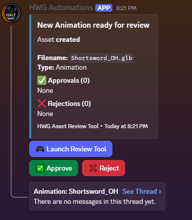
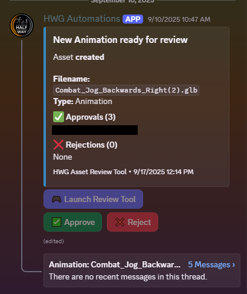
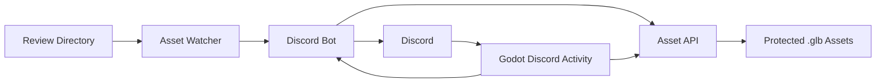

## Overview
The asset review tool is an asset automation pipeline that runs as a Discord activity, allowing users to view .glb 
files directly in Discord. The tool runs a Discord bot to handle the activity and communicates with a self-hosted 
Express.js server to manage serving the asset files.

## Goals
I wanted a way to make it easier for my friends to be able to review and give me feedback on assets I was creating 
for my game. Instead of requiring them to download the files and then also have the various software, such as 
Blender and Cascadeur, installed and up to date, I instead wanted to make it as simple as possible for them to 
review assets. It was challenging to get anyone to take the time to review things when it required work on their part. 
We already used Discord to talk to each other and for game-related discussions, so I wanted to build a tool that 
would eliminate the friction for reviewing assets and integrate into the platform. With a single click to launch the 
activity, a review could be started.

## Architecture
The tool consists of a three-service Docker Compose stack: The Discord activity, the asset API, and the asset watcher.
```
Docker Compose
├── Discord Bot + Activity
├── Asset API
└── Asset Watcher
```

### Discord Activity and Bot

<small class="image-caption">Discord Activty for reviewing the One-Handed Shortsword Animation Pack</small>

The Discord Activity is a small Godot web app viewer that Discord runs in the application as an iframe. The Godot app 
handles communicating with the Discord bot to authenticate the user and also to proxy the request to load the asset 
files to the asset API. The Godot viewer has a simple orbit camera for easier viewing of the asset and a timeline for 
scrubbing through animations and playback. 

The Discord bot is the only public-facing service in the stack. The Godot Activity handles the client-side 
presentation while the bot handles authentication, review messages, and communication with the Asset API. The bot makes 
posts to a dedicated channel in Discord, containing the name of the asset to review, the link to launch the activity, 
and then approval and rejection buttons. It also automatically creates a thread on that message for easy communication 
and feedback from reviewers.


<small class="image-caption">Review notification for the One-Handed Shortsword Animation Pack</small>

The messages stay active for a week, or until an asset is removed for review, and then disables the interactivity for 
that specific asset's embed. As users approve or reject, the results are collected and updated on the embedded message.


<small class="image-caption">Review notification that has been voted on and expired</small>

Because the asset files aren't intended to be publicly accessible, the viewer needed a way to prove that a request 
came from an authenticated Discord user. I used Discord OAuth2 to authenticate the activity with the bot and 
Discord's servers, and then issued a short-lived JSON Web Token that the activity could use when requesting an asset 
from the Asset API. The API validates the token before serving the requested file.

There can be multiple active reviews at a time, so the bot uses Discord's user info to track the message they interacted 
with and store the recent interaction. This is done so that when the activity authenticates with the bot, it can 
get the asset hash that this user last interacted with and inject that into the Godot viewer. Then, once the 
Godot viewer has started and is ready to load an asset, it grabs that asset hash and makes the request, which is 
proxied to the Asset API to get the correct asset file.

### Asset API
The asset API is the container that serves the protected assets back to the Godot viewer via the Discord Bot. It 
also handles authenticating the JWT coming with the asset request and decodes the asset hash to identify the asset 
to serve back to the Godot viewer.

### Asset Watcher
The asset watcher is the container that watches a specific review directory, waiting to respond to file events. 
Rather than exposing the filesystem path of an asset, the watcher generates a hash that acts as its identifier. The 
hash is passed through the review workflow and ultimately used by the API to determine which asset should be served. 
After detecting a new asset, the watcher notifies the bot, which then sends the review message and the embed in the 
Discord Channel.

## Review Workflow

1. A .glb file is added to the review directory
2. The asset watcher detects the file, generates a hash, and notifies the Discord bot
3. The Discord bot posts a message to the Discord channel
4. A user clicks to review the asset, which launches the Godot Discord Activity
5. The Activity authenticates with the bot and injects the hash into the viewer
6. The Viewer can then request the asset from the Asset API with a request that is proxied through the bot.
7. The Asset API decodes the hash and pipes the asset back to the viewer.

## What I Learned
This tool taught me a lot about how to build containerized applications and systems that work together. This was the 
first tool I built after building my homelab server, so it gave me an opportunity to learn about Docker Compose, 
Express.js and Node.js servers, and how to work with Discord bots. It also allowed me to learn about authentication 
with OAuth2 and JWT. This project allowed me to learn how to design several services to communicate with each other 
rather than building a single monolithic application. It taught me to think about the boundaries between services 
and what information should be shared between them.

## Results
This tool was incredibly effective in getting regular reviews on assets from my friends. It took all the friction 
out of reviewing that we had before. Previously, I would have to upload files to Discord or a file-sharing service 
and then try to get someone to download them and open them in Blender. Now, I could just drop a file into the 
directory on my server, and the rest was done automatically. Then, with just a click of the "Launch Review Tool" 
button, a review could be performed with no effort from the user. It went from asking for feedback repeatedly to 
getting it just a few minutes after dropping the file from anyone who was online at the time, with more coming in 
later in the day.

## Future Improvements
As I mentioned above, this was the first multi-container stack I built, and it was a learning experience on how to 
structure these types of systems. With what I've learned since building it, I would simplify the deployment and 
consolidate some services rather than maintaining three separate containers. I think the easiest approach would be 
to combine the watcher and API, then there would be a container for Discord (Activity and Bot) and an "internal" 
container on the server (Watcher and API).

The Godot Viewer could use some additional features, such as camera snapping, and some built-in assets that can be 
loaded for viewing with the animations that are being reviewed. For example, being able to load a sword model 
with the shortsword animations would be helpful for reviewing whether the weapon bones are also animated correctly, not 
just the character armature.
