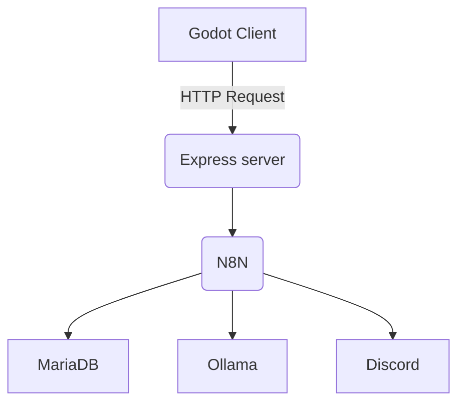
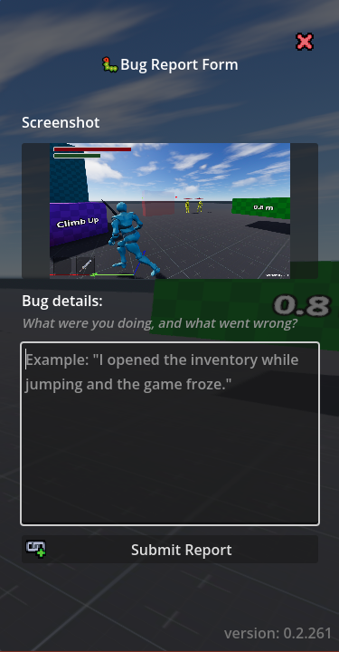
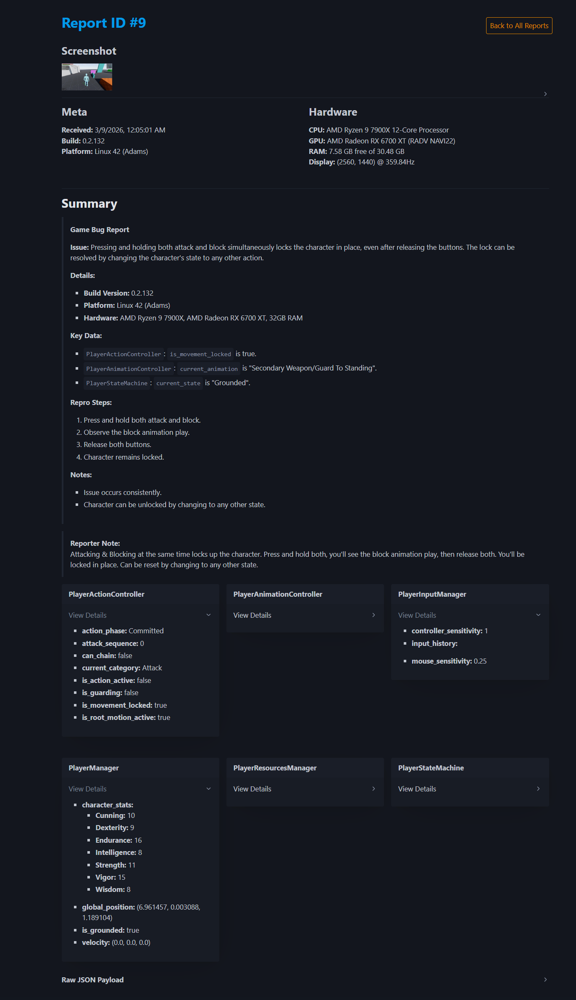
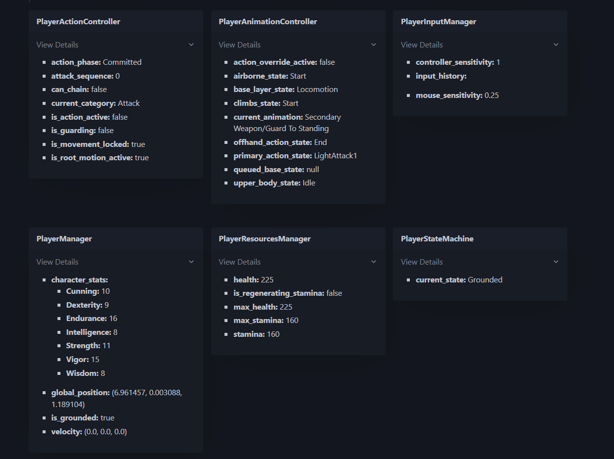
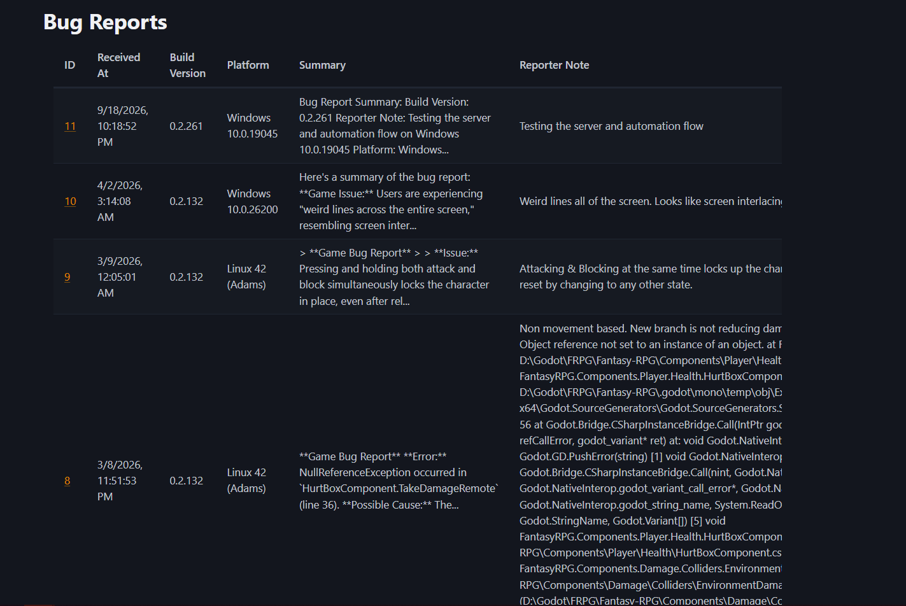

## Overview
This is an in-game bug reporting and diagnostics system for my Godot projects. It collects player-provided reports 
alongside contextual game and system stat, then sends those reports through a self-hosted processing pipeline for 
storage, viewing, and team notification. It uses an Express.js server to handle receiving and viewing reports, and an N8N 
workflow to process reports and notify Discord.

## Goals
This tool started as a value report form, a way to collect information from playtesters about the values they 
changed in game through the [CommandConsole](/projects/command-console). That info was then collected and submitted to 
a Google form. From that I could get an idea of what values were being changed and find averages for a good feel for 
player movement.

After that first movement playtest, I realized the potential of the tool and wanted to expand it into a full in-game 
bug report form that could also collect context and state, as I had seen in other games. I had already developed a 
way to collect changed values when using the value report form, so it just needed some minor modifications to be 
able to collect context and game state instead. At the same time, I was getting into self-hosting and developing 
things to run on my homelab, so it seemed a perfect opportunity to create something that could host bug reports there. 

## Architecture
The bug report tool consists of two parts: the in game tool that collects information from the user and the
game state, and the server that receives reports and handles viewing them.



### Reporter Form
In the value report form, when a user changed a value through a command, the command would add the changed value to a 
dictionary of all changed values. For the bug report rewrite, I expose a registration function for the reporter that 
allows relevant classes to register a callback to collect information from them when the bug report is created. This 
allows classes to register or deregister whenever they are or aren't relevant to the bug report. For example, when 
the local player is spawned, it registers callbacks to get state info for the animation system, locomotion state, 
inventory, input history, and other individual systems. If on a game map, and not a test environment, the locations 
can register world state information that could be relevant to a bug report. Because of this registration structure, 
a bug report can be created at any time and only collect information that is available when the report is generated. 
If you submit a report from the main menu, there may be some network state info to collect, but not player info yet. 
The payload that is generated is a dictionary of dictionaries, allowing each registrant to define its own "section" 
of data to send.

This structure keeps the reporter decoupled from the individual game systems it collects information from. The 
reporter doesn't need to know how any of the other systems work or what methods are available, it just allows them 
to register to provide diagnostic information they consider useful. This design also makes the system easily 
extensible as the game grows.

```csharp
public Dictionary GetDebugDictionary()
{
    return new Dictionary
    {
        {"base_layer_state", baseLayerPlayback.GetCurrentNode()},
        {"upper_body_state", upperBodyPlayback.GetCurrentNode()},
        {"airborne_state", airbornePlayback.GetCurrentNode()},
        {"climbs_state", climbsPlayback.GetCurrentNode()},
        {"action_override_active", oneShotActive},
        {"queued_base_state", queuedBaseState},
        {"primary_action_state", primaryActionPlayback.GetCurrentNode()},
        {"offhand_action_state", offhandActionPlayback.GetCurrentNode()},
        {"current_animation", lastAnimation}
    };
}
```
<small class="image-caption">Example of the the data sent by the Player Animation controller in my game.</small>


A bug report is generated when the form is opened. At the same time, a screenshot is captured to attach to the report.
In the form, there is a text entry area for a user to describe the bug or situation they are encountering; this is 
known as the "reporter note" in the bug report form. Upon submission, the report is sent to the server for processing.



### Server Side
The server side of the report tool is two components itself: the ingestion workflow, and the viewer. It is an 
Express.js server that handles the endpoints.

#### Ingestion Workflow
Report ingestion makes use of Busboy for handling the multipart form data of the screenshot and the report payload. 
The payload is a JSON object containing both metadata and the report payload. The metadata includes information such 
as build version, platform, and device information. The report payload contains the gathered bug report data. Once 
processed, the report is forwarded to N8N to follow an automation pipeline.


1. The workflow is triggered when forwarded from the server to the N8N container via a webhook
2. The json data is passed to an Ollama instance to generate a summary of the report.
3. The summary and report are stored in a database.
4. The summary and a link to view the report are sent to Discord to notify the team of the new report.

#### Report Viewer
The report viewer is a web application that allows team members to view individual reports or the entire collection. 
It uses server-side rendered React to display the reports from JSX templates. The individual report (the bug details 
page), outputs each of the individual sub-dictionaries from the report payload into collapsable sections, such as the 
data from the Player Animation Controller.


<small class="image-caption">Full bug report page</small>


<small class="image-caption">Closer view of the expanded report sections</small>

The entire collection is just a simple table view of the reports, linking to the individual report pages.



## Results
The biggest benefit of this tool is the amount of context available when investigating a report. Instead of just 
receiving a sentence or two description of a problem, such as "The player got stuck during a climb," I can see the 
state of the relevant systems, the player's recent inputs, and a screenshot of what the player saw. This 
significantly reduces the amount of information I need to reproduce the issue, as well as the number of followup 
questions of the player who submitted the report.

## Future Improvements
For this first iteration of the reporting tool, I made use of N8N to automate the pipeline of handling the report after
it is received. In the future, I plan to incorporate this automation into the tool itself, allowing it to handle storing
the report, getting the summary, and sending the notification in Discord. N8N was used because I already had it up 
and running on my server, so it was a convenient choice for automating the report handling process. As the tool 
becomes more established, moving that automation into the application itself would remove another dependency and 
give the ingest system more control over its own workflow.

I would also likely use something other than server-side rendered React to handle the viewer aspect of bug reports, 
such as a more lightweight framework or a static site generator.

Another future improvement for the tool that I plan to add soon is the ability to promote a bug to a GitHub issue. 
This will allow someone on the team with access to the viewer to quickly decide which bugs need to be addressed to 
make them issues on the GitHub repository, using the GitHub API. Then the tool becomes a complete development 
workflow, instead of just a data collector.