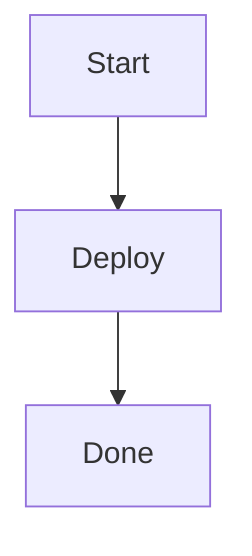
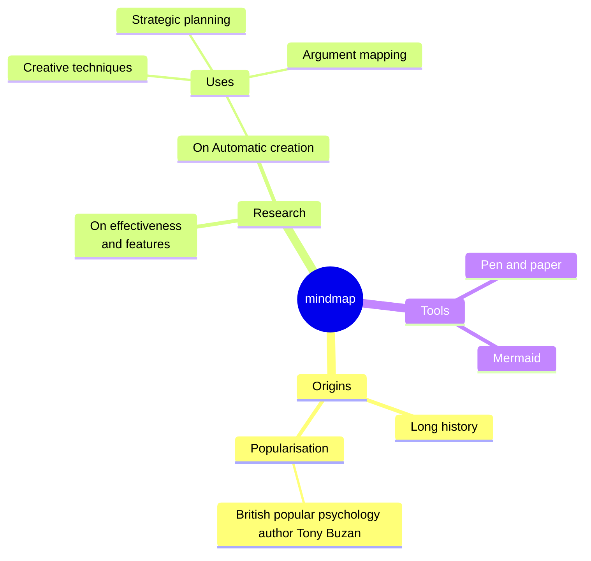

## Header

This is some text in the article.

## Features

- Reflection-based command handling
- Easy to use and extend
- Supports multiple platforms
- Integrates seamlessly with Godot projects


```csharp
private static void ExecuteCommand(string command)
{
    if (command.isEmpty())
        return;
        
   command.Run();
}
```


To create a table of contents or page minimap from Markdown headings in Astro, you can extract the heading array using Astro's built-in `getHeadings()` function (for direct imports) or the `headings` property (in layouts or content collections).
1. **Query or import the Markdown data** to access the `headings` list containing `depth`, `slug`, and `text` properties.
2. **Pass or iterate over the headings array** in your Astro component or layout to render a structured list.
3. **Map the heading depths** (`depth: 1` through `6`) to indentation classes and link each item to its generated anchor `slug` (`#slug`).

Here is an example implementation inside an Astro layout or page using content collections / direct rendering:astro


### Callouts

> [!note]
> This is a useful piece of information that users should notice.
> It can span multiple lines
>
> This one even has a gap above

> [!WARNING]- 
> this is some important info here

> [!tip]
> This is a tip

> [!important]-
> This is an important callout

> [!caution]
> This is a caution

```astro
---
// Example: Accessing headings from a rendered content collection entry or import
const { headings } = Astro.props;
---
<nav class="minimap">
  <h2>On this page</h2>
  <ul>
    {headings.map((heading) => (
      <li class={`depth-${heading.depth}`}>
        <a href={`#${heading.slug}`}>{heading.text}</a>
      </li>
    ))}
  </ul>
</nav>

<style>
  .depth-2 { margin-left: 1rem; }
  .depth-3 { margin-left: 2rem; }
  /* Add further styling for your visual minimap/sidebar */
</style>
```
### Charts



Use code with caution. Would you like:An example using IntersectionObserver to highlight the active heading in the minimap as the user scrolls?A guide on configuring rehype plugins to customize how Astro generates heading IDs and slugs?

#### Mermaid Chart

