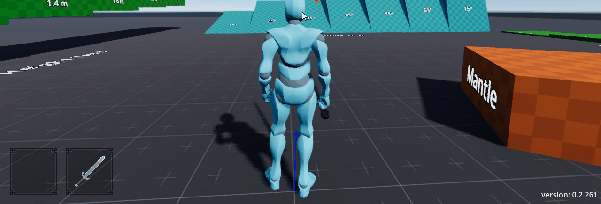

A reflection-based runtime command console and logging system for Godot projects, built to make development, playtesting, and debugging easier.





## Overview
This command console addon is a reflection-based runtime development console and logging system for Godot projects, 
built to make development, playtesting, and debugging easier. Commands are added by simply adding a static method to 
a script and decorating it with the `[ConsoleCommand]` attribute. When the project starts, all commands are automatically 
discovered and added to the console. The command attribute features optional parameters for specifying a prefix to 
group commands and writing a description to provide context for the command.

## Why Build It?
As my game began to grow and there were more things to test, I needed a way to be able to set up specific conditions 
easily. I also wanted an easy way for my friends, who were playtesting, to be able to edit various values in the builds 
I sent them to find what felt right. Previously, they would need to have access to the project in Godot and know how 
to tweak values in the inspector before they could run the game and test again. Inspired by a few other command 
consoles I had seen in games or other Godot projects, I decided to create my own version.

With this console in place and some commands on the player to tweak individual settings, I was able to quickly find 
values that would make the character controller feel right. A playtester could fine-tune whatever setting they found 
was off until they found something that felt right. For example, if the jump was too high, they could run the 
command `Player.SetJumpHeight 2.5` to adjust the jump height, test again, and continue to tweak until they found a 
value that felt right. Without ever having to close the game, find the setting in the inspector to change, and then 
rebuild and play again.

## Structure
The tool is broken down into a handful of different components. 
- DevConsoleUI: handles the display, input of commands, showing of suggestions, and filtering of logs. 
- DevConsole: registers all the commands in the project and handles their execution by converting parsed argument inputs into their data types. 
- ConsoleInputParser: quote-aware parser responsible for splitting the input into a command and its individual arguments.
- DevConsoleLogger: handles logs throughout the project and formatting them as Log Entries with timestamps and caller info.
- ConsoleAutocomplete: takes parsed and partial input to fuzzy search commands and provides suggestions based on their scores against the input.

### Parsing and Converting Arguments
Because console input begins as text, the console needs to translate those arguments into the parameter types 
expected by the registered method. This allows commands to use normal C# parameter types rather than requiring every 
command to manually parse its arguments. The parser splits input into a command and individual arguments, then the 
console can convert the supplied values into the types needed for the command method and invoke it with the 
resulting arguments.

## Goal
The goal of the console's design is not only to make it easier to find information and invoke commands at runtime, 
but also to make it easier for developers to use when writing code. As mentioned above, registering a command is as 
easy as decorating a static method with the `[ConsoleCommand]` attribute, and logging is as simple as calling the 
logger and specifying a log level `Log.Info(string message)`.


## Learnings
Building this tool allowed me to learn how to implement fuzzy search and score results, which was a fun challenge. 
I also learned some basics of reflection in C#, which for a use case like this, where I'm gathering methods 
decorated with an attribute, is easier than I expected. I chose to use reflection for command registration because I 
wanted the process to require as few steps and boilerplate as possible. Rather than requiring users to register a 
command somewhere or modifying the console itself, the console can instead scan the project's assemblies to find methods 
with the `[ConsoleCommand]` attribute and build its command list automatically. This also allows command definitions to 
stay close to where they are used. For example, the `Player.SetJumpHeight` command I used before can live in the 
player's jump state class. Requiring a static method makes it a little awkward, requiring me to store a static 
instance of the player, but it's a small tradeoff for keeping the plugin simple. In my implementation of player-related 
commands, I use the LocalPlayer static variable and then get the node for the jump state and modify it's `jumpHeight` 
variable.

```csharp
[ConsoleCommand(Prefix = "Player")]
public static void SetJumpHeight(float height)
{
    PlayerManager.LocalPlayer.GetNode<JumpState>("Player State Machine/JumpState").jumpHeight = height;
}
```

## Results
The resulting plugin made it incredibly easy and straightforward to add new commands for testing various aspects of my game.
With a simple attribute tag on a static method, I can have a new command to use in my games. The biggest benefit was 
shortening the feedback loop during playtesting. Instead of stopping the game to change values in the editor, I 
could make changes while the game was running and immediately test them. This also gave playtesters access to the 
same controls without requiring them to open the project in Godot.

## Future Iterations
In future iterations of the console, I plan to include customizable settings for the plugin, which can be tweaked in 
Godot's Project Settings panel. It would allow for styling changes to fit your project's theme and customizing 
values such as the number of suggestions returned.

I would consider adding support for instance methods, instead of just static commands, as this could allow for a lot 
more flexibility in how commands are used in development and playtesting. It would, however, require users to navigate 
the scene tree to select the instance they want to invoke the command on and require the console to understand the 
type of object that is 'selected'. 

I would also add an optional parameter to the attribute to allow developers to provide example data for command 
arguments. This could be useful for showing expected ranges or formatting of values for non-primitive types.
