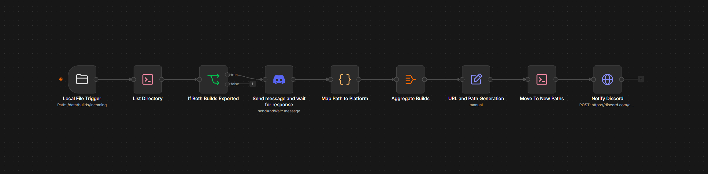
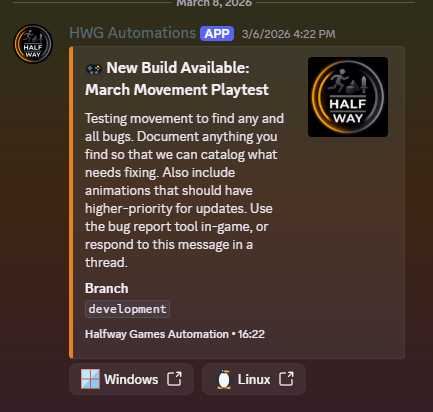

## Overview
This is a simple workflow that allows game builds to be distributed to my team and playtesters on Discord through 
download links on the Half-Way Games domain and hosted on my homelab server.

## Goals
As my game grew in size with more assets and features, I needed a better way to send builds out to be tested than 
just uploading .zip files to Discord or a file host somewhere. I already had my homelab server and a Cloudflare 
tunnel running to an NGINX container, and I had N8N automations for other tasks, so this automation seemed a natural fit.
My goal when starting out was to reduce the amount of manual work required to distribute builds to my team and 
playtesters and give them an easy way to download the latest one.

## Why This Approach?
I chose to build this as an N8N workflow rather than a standalone application or microservice because the problem 
was essentially one of connecting existing systems. The build was already being produced by Godot, the 
files were already accessible from my server, and I already used N8N. The automation in N8N gave me a convenient way 
to connect the filesystem, Discord, and the web server without introducing another container to maintain. 

## Automation
The automation is pretty simple and works in a very linear fashion.

1. Build all in Godot, with output targeting a folder on an SMB share to my homelab
2. N8N has a file trigger watching that incoming builds folder, which starts the automation workflow
3. List the zip files in the directory and check that both have finished writing. Exit early if only one is there, 
   as the automation will trigger again once the second file is written.
4. Send a message to me on Discord and wait for a response.
5. Identify the platform for each build, either Windows or Linux.
6. Generate the new paths for the files and the download URLs.
7. Move the files to the new path, a location where they can be served by NGINX
8. Send a message in Discord as an embed with the download links and the information about the build.

<small class="image-caption">Example of the embed that is sent. From a past playtest.</small>

## Results
The current iteration is just a button press and a little bit of manual entry to fill out the form about the build's 
purpose. It is quite easy and much nicer than having to move files around, try to upload them to Discord, only for 
the file to be too large, and then share it on Google Drive or something similar. With this workflow, I click "Build 
All" in Godot, and then, once the build is complete, I get a DM in Discord to fill out the form. A moment later, the 
automation is posting the embed in the main Discord channel with Windows and Linux download links.

## Future Improvements
This is one of the first tools I plan to update. It will actually be more of a rebuild. Instead of using an N8N 
automation which is semi-manually triggered (requiring the build to be triggered from Godot and placed in a 
server-accessible directory), I want to make use of GitHub Actions for the automation. In my workflow, merging into 
the main branch signifies a new test release, as feature branches all merge into "develop". On merge into main, the 
automation will trigger and build the game, then serve download links for the artifacts to Discord from the repo, 
instead of my homelab server. I can also remove the manual entry step of filling out the form about the build's 
purpose and details, and instead pull this information from a section in the pull request template. This still 
incorporates the human factor of describing the build but is streamlined into a step I'm already taking in filling 
out the pull request template.